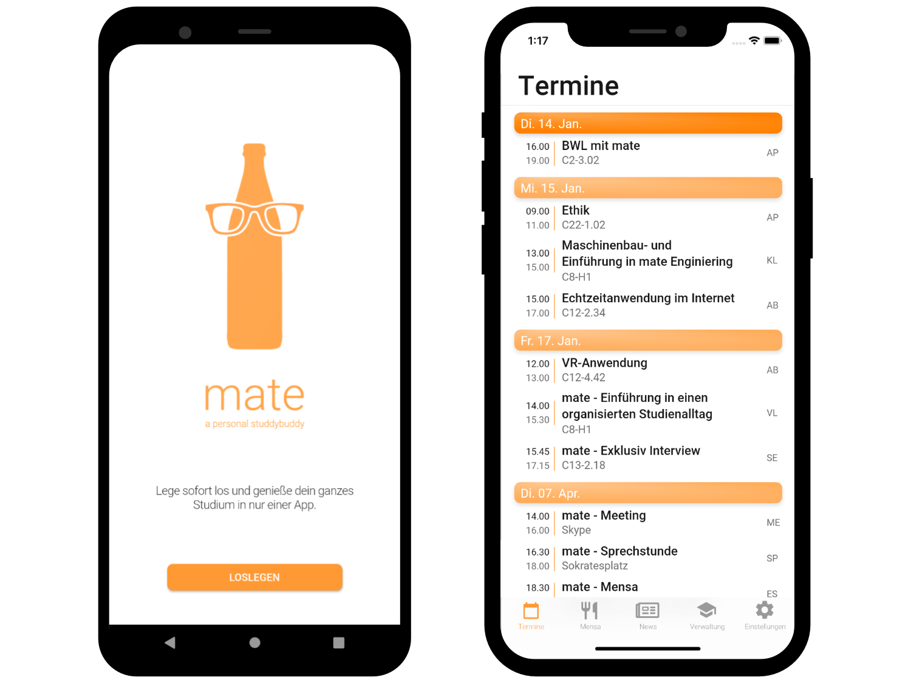
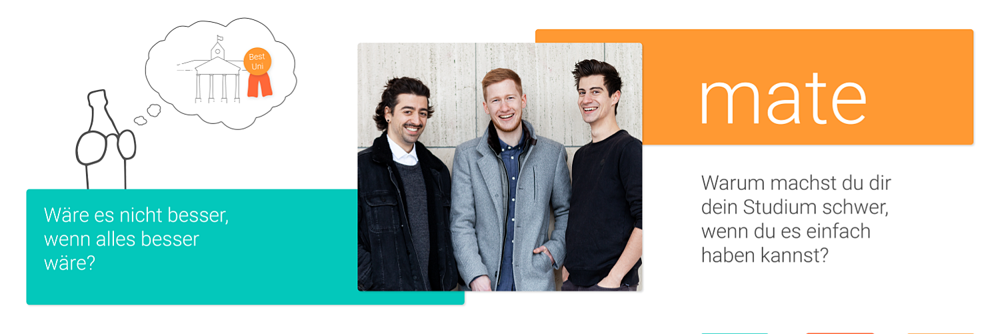

- Flutter
- Firebase
- Python
- Node.js

# mate

In my final year in university two friends and I created a cross-platform app, which helps students manage their education. The app was developed using Flutter and hooked into a SaaS backend with Firebase Firestore and Google Cloud functions.

Mate was a project two friends and I created as part of classes in university as well as in our spare time. I was responsible for the development, though some tasks were executed by whoever had the knowledge and time. The goal of mate was to combine several services for all of which students have to visit separate badly optimized websites in a well-designed and user-friendly mobile app for iOS and Android.
An early prototype for illustration was built with Vue, but we soon switched to Flutter, a cross-platform framework made by Google on top of Dart, which is compiled into native code. I created the architecture and functionality within the app like handling data and user input, wrote tests, and implemented backend services like scrapers, authentication, and endpoints.

## Challenges

There are a lot of challenges when developing your first „real“ mobile app. One of the big ones for us was to understand that programming mobile applications is different from programming traditional websites. While most traditional websites work in a response-request manner, state management is way more important for mobile applications. Since Flutter was relatively new, especially when we started in late 2019, tutorials and the overall community around it were not that big compared to native development or popular web technologies. Another huge challenge was to retain the information. Since our university had no public or private APIs we were allowed to access, we had to rely on web scraping using Node.js inside Firebase Functions most of the time, which comes with a lot of overhead and isn’t as stable as RESTful API‘s are. For more complex scraping like getting content secured behind logins, we used a Python script hosted inside a Google Cloud instance. To reduce our load we checked every few minutes for university news and on request for grades. We saved all the publicly available data inside a NoSQL Firebase Firestore database, any personal data was saved directly on the device.

## Review

For distribution and release, we went so far as to release several versions with Apple TestFlight as well as Firebase Distribution but ultimately decided against founding a company and releasing the final version, because we identified scraping as too inefficient and unstable of a data source. The lack of help from the university drove us to consider this project as completed with only the frontend being finished. Despite all these struggles, this was a really fun project for all three of us. We learned about a lot of different aspects of mobile development, UI/UX design, deployment, and legal considerations around founding a company as well as privacy concerns when working with personal data.