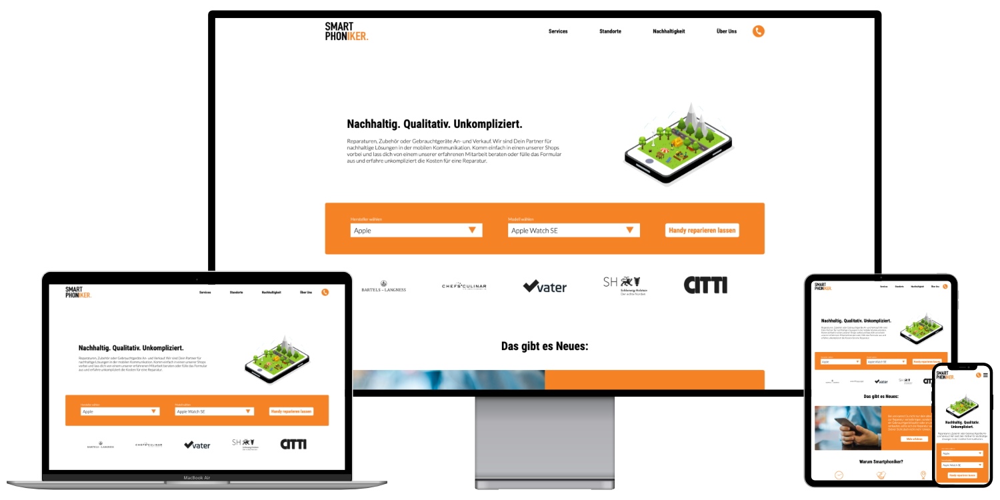
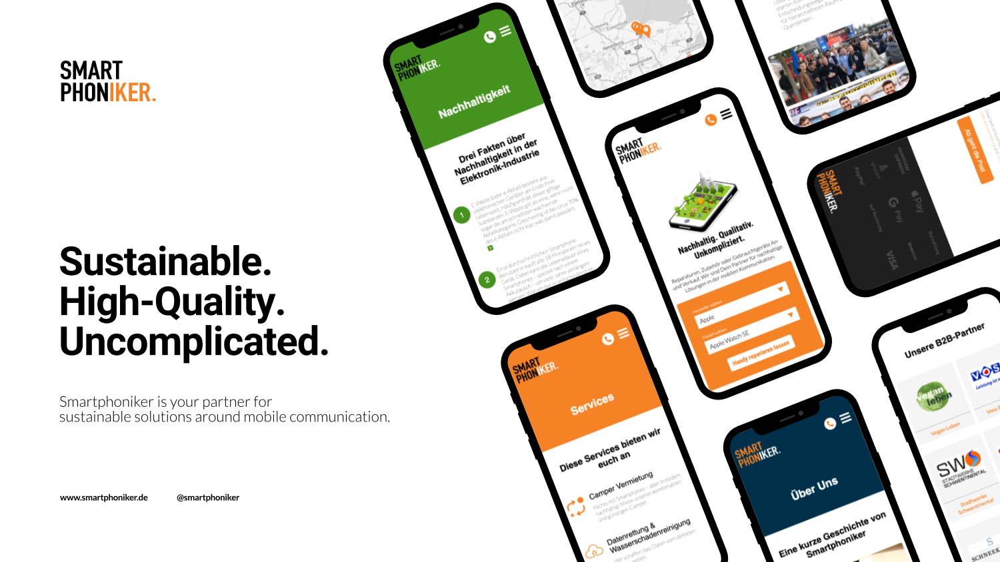

- Design
- WordPress
- PHP
- SEO

# smartphoniker.de

During my thesis I designed, developed and deployed a new website for a mobile communications company, which focuses on sustainable solutions for individuals. The website was implemented using custom WordPress functionality as well as a custom designed theme.

Smartphoniker GmbH is a local mobile communications company from northern germany, which focuses on sustainable solutions for individuals. Their services include repair of devices, sustainable accessories, mobile phone contracts and purchasing, refurbishing and selling used devices to their customers.
The objective for this project was to create a newly designed website that better matches their business values. Other requirements encompass an improved performance compared to the old website, easy content administration for non-developers, more effective call-to-actions and conversion of online visitors to local paying customers.

## Challenges

One huge task with client projects as a freelancer is always to identify the specific needs for the project, especially when clients aren’t 100% sure on the details. Taking that into consideration it is necessary to practice as clear communication as possible. Another endeavor to join varying expectations was to articulate the requirements in a working session together and to gather feedback regularly. Since I was not very comfortable with WordPress and used to other technologies, getting a hang on the „WordPress-Way“ of doing something was challenging. Fortunately I learned from prior projects to put in thought in the overall project architecture as well as functional scalability before execution. This allowed me to adjust to different plugins and patterns later on, which made deciding on the ideal ones much easier. To accommodate the different aspects of the project and to balance developer-friendliness, performance and easy administration was hard. I evaluated a lot of different options within the constraints of the project and finally decided to take a hybrid-approach and create custom Gutenberg blocks using Carbon Fields. This developer-focused plugin was the preferred solution, because it allows to define blocks within the code to make continuous deployment easy and possible. Me and other developers down the road add and can improve upon functionality without needing to log into the Webserver at all. It also helped me to create flexible designs and easy-to-use functionality for non-developers.

## Review

Data from surveys strongly suggests, that the design delivers the prescribed characteristics very well. The performance is great with a consistently high Google Page Speed score above 90 and insights from analytic-software indicates great user engagement. And even though data is only part of a story and despite the above challenges and writing my thesis on this topic at the same time, I am proud of the result and the client was satisfied and agreed upon further projects in the future.