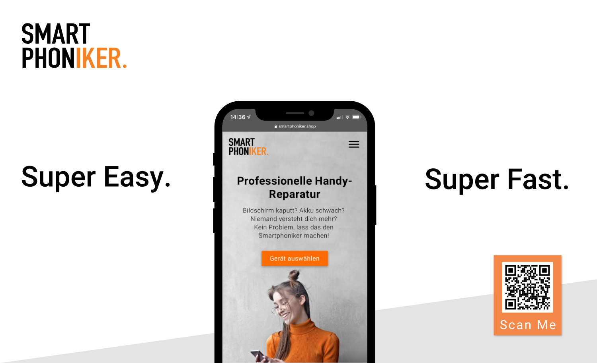

- Design
- JavaScript
- Sass
- Jinja2

# smartphoniker.shop

This project is a simple shop system for offering smartphone repairs for a wide range of manufacturers and devices. I was responsible for the design and development of the frontend. The website was implemented using a custom Flask-Server with the Jinja2 Template Engine and a PostgresSQL database.

The client Smartphoniker GmbH is a local mobile communications company based in northern Germany, which focuses on sustainable solutions for individuals. Their services include repair of devices, sustainable accessories, mobile phone contracts, and purchasing, refurbishing, and selling used devices to their customers.
The objective for this project was to lift the weight of the workers in the stores by moving the process of retrieving price and device information online in an easy-to-use interface for potential customers. Other requirements were good performance and easy content maintainability for non-developers. The design should also respect the companies colors and style. A requirement that came up during implementation was to add a searchable FAQ section.
<a class="case-study__link" href="https://leonmortenrichter.de">Leon Morten Richter</a>, a backend engineer, and I did this project together. He was responsible for the server-side logic, deployment, and code review. My role included designing the interface, creating the templates using Jinja2, implementing vanilla JavaScript UI interactions, and occasionally building some smaller backend functionality.

## Challenges

Designing an understandable and simple application flow for customers in this kind of industry, especially for someone who might not know all that much about smartphones, is very challenging. It requires minimizing the visual clutter while condensing the required steps to collect an order as much as possible, all while not stripping away helpful information too much. The solution I came up with took a lot of design revisions and audience tests. Implementing a progress bar as well as adding the most common devices to the front page helped, but were only the larger necessary changes. To avoid a mostly text-based interface I created over 150 graphics for over 30 devices to not only indicate different models, but also different repair options. After creating the flow and design of the application implementing template files with Jinja2 was comparatively straightforward.

## Review

Even though leads weren’t measured before, descriptive evidence suggests a higher number of booked repairs than before. Other than that the shop is still used and the client is satisfied. This and the fact that this was my first paid project, created in my spare time during my middle year in university, made this project a success.